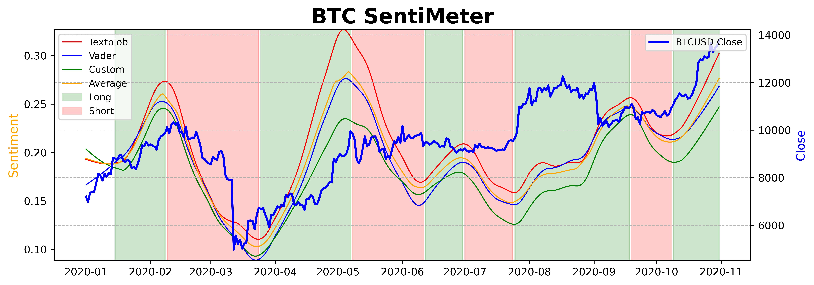

# Sentiment Analysis Bitcoin

This is a project I realized to understand in advance when Bitcoin price will reverse, exploiting the sentiment on Twitter with NLP and Machine Learning techniques.

## Key Steps:
- **Tweets scraping**: I scraped millions of tweets mentioning "Bitcoin"
- **NLP Preprocessing**: Strong applications of the best NLP techniques to preprocess the text and polarize as most as I could the sentiment.
- **Modelling**: I applied VADER, TextBlob, Flair and a custom Machine Learning based on a labelled dataset about millions of tweets.
- **Insights**: At the end I wanted to get insights with the results, in order to use these models as a trading indicator for my strategies. Curiously, all the models share the same pattern.

## Short slides:

### Modelling sentiment (TextBlob and VADER) with LOESS vs BTC prices
We observe an incredibly correlation between sentiment and prices and its powerful ability to anticipate price movements.

### Huge correction predicted
The strong divergence observed in the last weeks between sentiment and prices, anticipated a predicted correction on prices.

### Indicator as a tarding signal
In green I've highlighted the long periods and in red short ones. I defined them based on the change in derivative of the sentiment's LOESS calculated.

[Click here to view the full slides](https://github.com/DanieleRaimondi/Sentiment_Analysis_Bitcoin/blob/main/docs/slides.pdf)