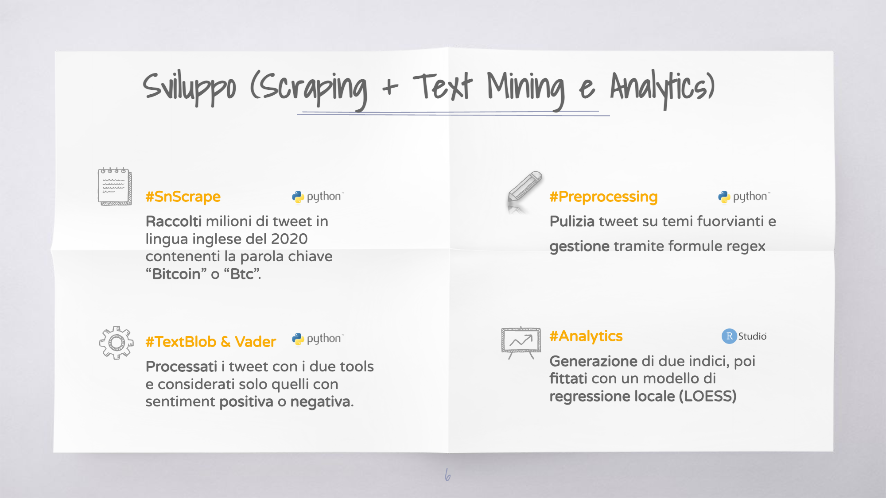
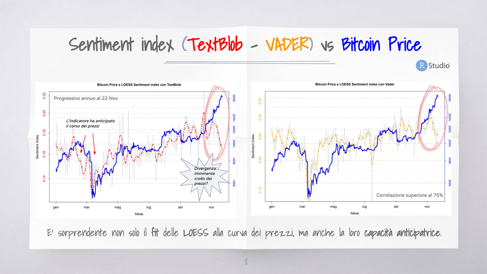
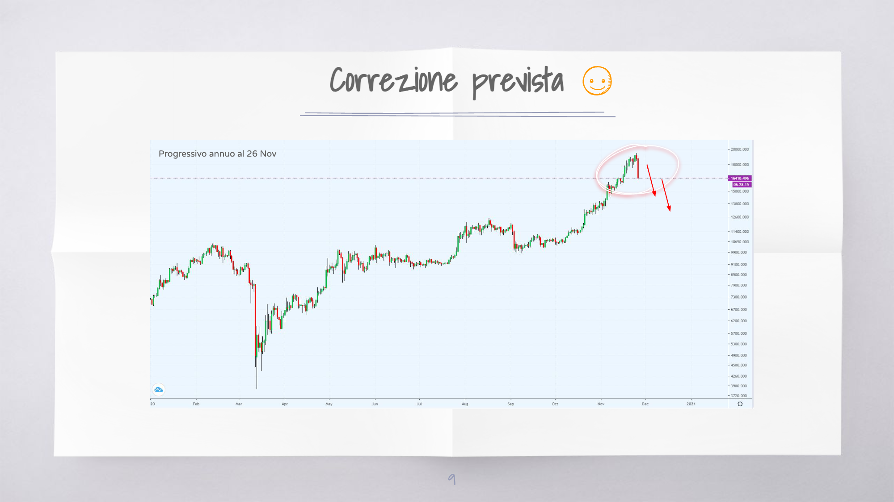

# Sentiment_Analysis_Bitcoin

This is a project I realized to understand in advance when Bitcoin price will reverse, exploiting the sentiment on Twitter with NLP and Machine Learning techniques.

## Key Points:
- **Initial Odds Determinants:** Various factors influence the starting odds for football teams, reflecting their probability of success. Stronger teams generally have lower odds.
- **In-Game Odds Fluctuations:** During the match, odds fluctuate based on market dynamics and real-time game events. Bettors' expectations are influenced by game statistics and possibly by commentary on key actions.
- **Research Focus:** We evaluate odds for the final result ("1X2") and five under/over markets ("0.5", "1.5", "2.5", "3.5", "4.5"). Additionally, we consider the associated monetary volumes in EUR.
- **Game Statistics:** Key statistics from diretta.it include ball possession, number of dangerous attacks, and total shots by both teams. Our initial hypothesis is that as a team dominates, their odds decrease due to increased betting on them.
- **Impact of Key Events:** Events like corners and free kicks cause short-term fluctuations, while significant events like red cards or key player injuries cause substantial deviations, sometimes up to 100%.
- **Under/Over Markets Focus:** Under markets tend to converge towards odds of 1 as time progresses and the outcome becomes more certain. We explored the price positioning of an under market following a goal, finding it aligns with the next lower market price prior to the goal.
- **Volatility and Trading Opportunities:** Goals create high volatility, and the estimated landing price is balanced between supply and demand, presenting various profit opportunities through an automated trading system. This system is effective not only for predicting post-goal prices but also throughout the match, leveraging constant odds decrements and market inefficiencies.

In summary, our study aims to identify how in-game events and statistics influence betting odds, providing insights for developing profitable trading strategies in sports betting markets.

## Short slides:

[Click here to view the full slides](https://github.com/DanieleRaimondi/Sentiment_Analysis_Bitcoin/blob/main/docs/slides.pdf)